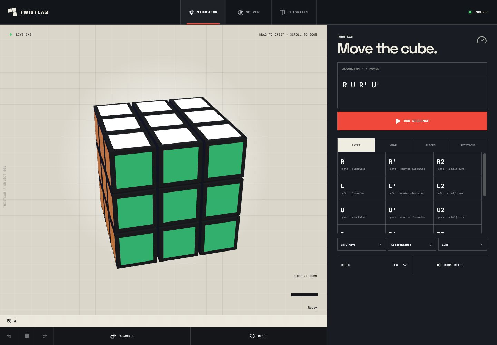
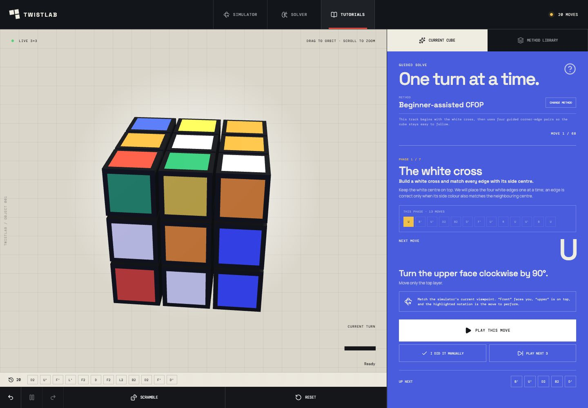
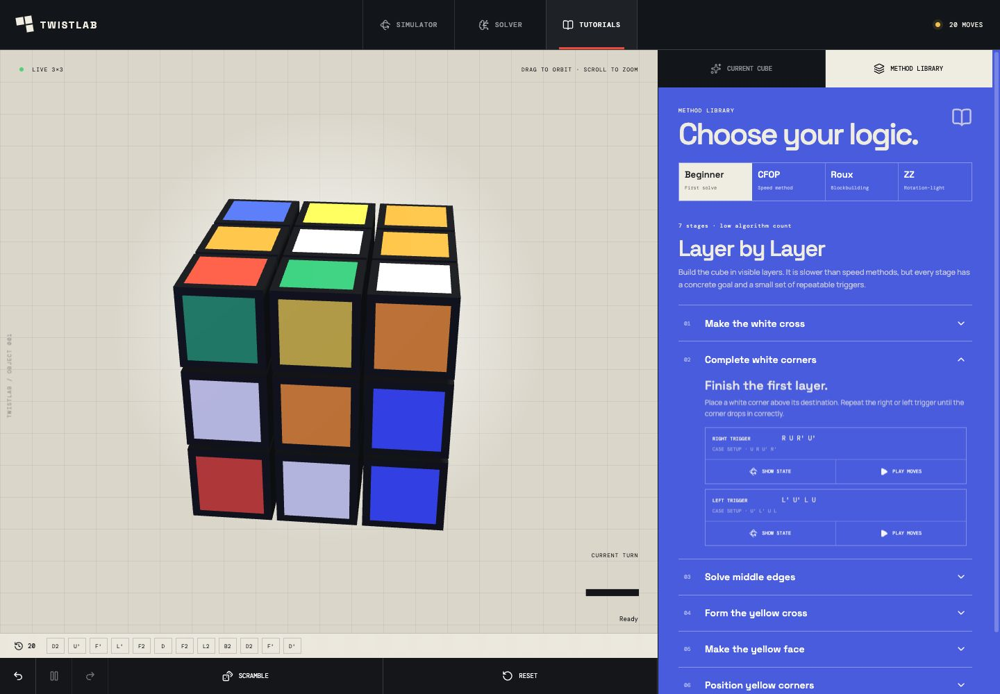

# TwistLab

TwistLab is an interactive, browser-based laboratory for learning how twisty puzzles move. The first study is a tactile 3×3 cube with animated notation playback, deterministic state tracking, and an editorial learning experience.

**[Launch TwistLab](https://ompatnaik.com/TwistLab/)**



## Features

- Interactive WebGL 3×3 cube with orbit and zoom controls
- Standard face, wide, slice, and whole-cube notation
- Animated algorithms with pause and speed controls
- Scramble, reset, undo, redo, and move history
- Renderer-independent cube state and solved-state detection
- Shareable algorithm URLs
- App-style Simulator, Solver, and Tutorials workspace tabs
- Move pads for face, wide, slice, and whole-cube turns
- Personalized step-by-step tutorials for the current scramble
- Beginner-assisted, CFOP, and fast-solution tutorial tracks
- Named learning phases with goals, explanations, and state-specific moves
- Algorithm case setup and animated playback in the method library
- Animated next-move playback and manual move confirmation
- Responsive layouts and reduced-motion support

## Guided learning

The current-cube tutorial turns a scramble into a method-aware lesson, beginning with stages such as the white cross and keeping the virtual cube synchronized with every move.



## Method library

Explore Beginner, CFOP, Roux, and ZZ concepts. Algorithm cards can prepare the example cube state and then animate the moves from that exact case.



## Local development

```bash
npm install
npm run dev
```

## Verification

```bash
npm run test
npm run build
npm run lint
```

## Roadmap

- Timeline scrubbing and algorithm annotations
- Saved solves and timing statistics
- Puzzle definition API
- 2×2 and Pyraminx studies
